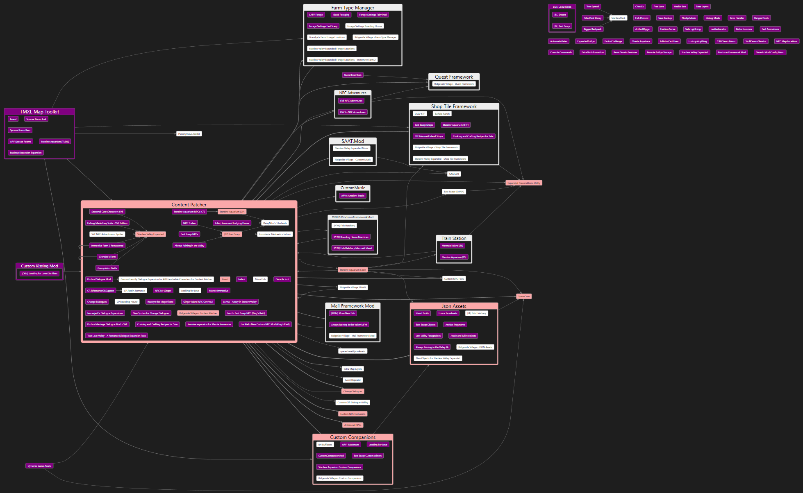
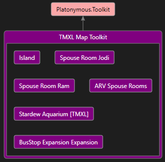

**Mod Dependency Analyzer** is a little utility which analyzes a Stardew Valley `Mods` folder and
generates a directed graph of mod dependencies. The generated `.dgml` file can be opened in DGML
viewers like Visual Studio to visualize the data.

# Usage
## First-time setup
1. Install [Visual Studio](https://visualstudio.microsoft.com/) if needed (the Community edition is
   free and has all the features you'll need).
1. In Visual Studio, click _Tools > Get Tools and Features_.
2. Click the _Individual Components_ tab and install _DGML editor_.

## Generate a `.dgml` file
1. Open the project in Visual Studio.
2. Edit the options in the `config.json` file if needed.
3. Click _Debug > Start Without Debugging_ to launch the app.
4. Follow the on-screen instructions.

## View the dependency graph in Visual Studio
First:
1. Double-click the `.dgml` file to open it in Visual Studio's DGML editor.
2. Click _Layout > Analyzers_ at the top of the DGML editor, and enable _Find Hubs Analyzer_ and
   _Unreferenced Nodes Analyzer_.

This will show a quick visual overview of the dependencies:
> 

Specifically...
* Content packs are grouped under the framework that loads them. (You can turn that off in the
  settings.) Dependencies for each content pack are linked to the group for readability, but you
  can click any content pack to see its specific dependencies.
* Mods which are required by many other mods are highlighted in red (like Content Patcher).
* Mods which aren't required by any other mods are highlighted in purple.

For example, in the screenshot we can see that the entire TMXL Map Toolkit group is unreferenced.
That means we could remove TMXL Map Toolkit and all its content packs, and all the other mods would
still be loaded fine.

You can also view specific subtrees. For example, which mods need the _Platonymous.Toolkit_
framework (directly or indirectly)?
1. Right-click _Platonymous.Toolkit_ in the graph, and choose _Select > Incoming Dependencies_.
   This will highlight the _direct_ dependencies.
2. Right-click the graph background, and choose _Select > Incoming Dependencies_ again to add the
   incoming dependencies for all the selected mods. Repeat until no more mods get selected.
3. Right-click the graph and choose _New Graph From Selection_.
4. That gives us a graph of all the mods which need that mod installed:
   > 

You can view similar trees like _Select > Outgoing Dependencies_ (mods needed by the selected mod),
or _Select > Connected Subgraph_ (every direct or indirect dependency or dependent).

## Export graph to image
1. [Open the graph in Visual Studio](#view-the-dependency-graph-in-visual-studio).
2. Click _Share > Save as Portable XPS_ at the top of the DGML editor.
3. Use an online XPS to PNG tool like [Zamzar](https://www.zamzar.com/convert/xps-to-png/) to
   convert it into an image.

## Export graph to PDF (Windows only)
1. [Open the graph in Visual Studio](#view-the-dependency-graph-in-visual-studio).
2. Click _Share > Save as Portable XPS_ at the top of the DGML editor.
3. Open the exported file in [XPS Viewer](https://allthings.how/how-to-install-xps-viewer-on-windows-11/).
4. Click _File > Print_, then choose _Microsoft Print to PDF_.

# For constributors
## Bundled dependencies
The `lib` folder includes two dependencies:

* [DgmlImage](https://www.nuget.org/packages/DgmlImage) 1.2.0.1, extracted from the NuGet package
  since NuGet no longer supports referencing bundled files.
* [SMAPI](https://smapi.io/) mod toolkit 3.14.5, taken from the game's `smapi-internal` folder
  after installing SMAPI.
